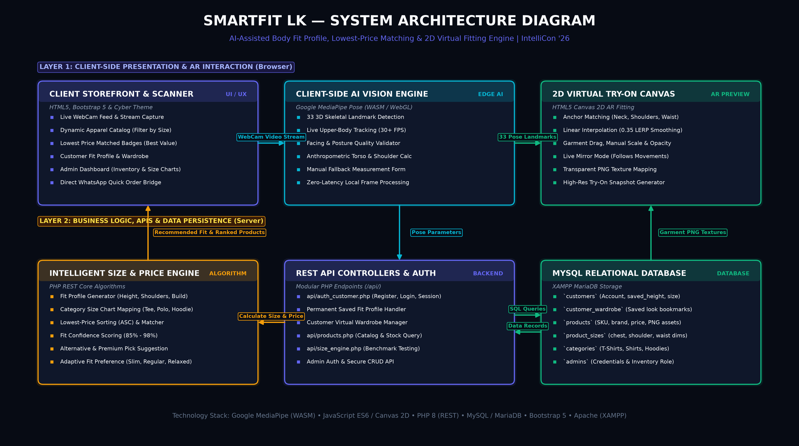

# 👗 SmartFit LK — AI-Assisted Body Fit Profile & Lowest Price Virtual Fitting System

> **Submission 2: Build Checkpoint** | **IntelliCon '26** (Organized by AIESEC in SLIIT)  
> 🔗 **Public GitHub Repository:** [https://github.com/janithjanithdamsara-coder/SmartFit-LK](https://github.com/janithjanithdamsara-coder/SmartFit-LK)  
> 🎥 **2-Minute Working Demo Video (Google Drive):** [Watch Live Video Demonstration](https://drive.google.com/file/d/17uSB_dGCN8zI25tctFwg0YyAbq4OAW6J/view?usp=sharing)

---

## 📌 1. Project Overview & Problem Statement

Online fashion retail in Sri Lanka and globally faces a staggering **30%–40% return rate** primarily caused by **size uncertainty** and customers being unable to visualize how clothes fit their physique before purchasing.

**SmartFit LK** solves this by turning any standard web browser into an **AI-powered Smart Mirror**:
1. **Camera AI Scan:** Analyzes upper-body posture & proportions in real time using 33 3D Pose Landmarks (Google MediaPipe).
2. **AI Estimated Fit Profile:** Estimates shoulder width, torso proportion, and height without requiring expensive 3D LiDAR sensors.
3. **Lowest Price Match Engine:** Cross-references the customer's size profile against shop inventory and ranks matching clothes from the **lowest price (🥇 Best Value)** to premium options.
4. **2D Interactive Virtual Try-On:** Live WebCam AR canvas overlay allowing users to preview garments on their torso before ordering.
5. **Direct WhatsApp Ordering:** One-click order with pre-filled SKU, size, and price for Sri Lankan e-commerce operations.

---

## 🚀 2. System Architecture & Flow



```
                      SMARTFIT LK
                           │
                           ▼
                   📷 Start Camera
                           │
                           ▼
             Google MediaPipe Pose (WASM)
                (33 3D Body Landmarks)
                           │
                  ┌────────┴────────┐
                  ▼                 ▼
            Torso Height       Shoulder Frame
                  │                 │
                  └────────┬────────┘
                           ▼
               AI Estimated Fit Profile
            (Height: ~174cm | Build: Athletic)
                           │
                           ▼
                  Category Multi-Sizing
              (👕 Tee: M | 👔 Polo: M | 🧥 Hoodie: L)
                           │
                           ▼
               Size & Price Match Engine
                           │
                           ▼
            💰 Matched Products (Price Sorted)
         ┌──────────────────────────────────────┐
         │ 🥇 Lowest Price: Rs. 1,800 (Fit 96%) │
         │ 🥈 Value Pick:   Rs. 2,800 (Fit 94%) │
         │ 🥉 Premium Pick: Rs. 4,200 (Fit 92%) │
         └──────────────────────────────────────┘
                           │
                           ▼
               👕 2D Virtual Try-On (AR)
                           │
                           ▼
                🛒 Direct WhatsApp Order
```

---

## ✨ 3. Core Features

### 🔹 A. Real-Time AI Body Scanner
- 33 3D Pose landmarks detected client-side with zero latency.
- Orientation check ensures users face the camera directly before locking pose.
- Anthropometric ratio calibration normalizes camera perspective using height.
- Fallback **Manual Parameter Calculator** for users without a camera.

### 🔹 B. AI Estimated Fit Profile
- Replaces unrealistic decimal claims with scientifically sound body profiles:
  - **Height:** ~174 cm (Approximate)
  - **Shoulder Frame:** Medium Frame (42 - 45 cm)
  - **Upper Body Build:** Regular Athletic
  - **Waist Range:** ~81 cm (32 in)
- Category recommendations tailored to garment type:
  - T-Shirts & Polos: **M**
  - Hoodies & Outerwear: **L** (Relaxed Streetwear Fit)

### 🔹 C. 💰 Lowest Price Matching Engine
- Dynamically queries shop database for in-stock garments matching the recommended size.
- Automatically sorts by `price ASC`:
  - 🥇 **Lowest Price Match:** Highlighted with a gold pulsing border & Best Value badge.
  - 🥈 **Value Pick & Alternative:** Secondary budget-friendly activewear.
  - 🥉 **Premium Tier:** High-density streetwear & heavy outerwear.

### 🔹 D. 2D Interactive Virtual Fitting Atelier
- Real-time 2D Canvas rendering anchored to body landmarks (`neckBaseY`, shoulders, and hips).
- Live AR Mirror mode tracks body movement smoothly with a `0.35` LERP filter.
- Manual drag, zoom scale slider, and opacity blend slider.
- Snapshot capture & photo download for sharing.

### 🔹 E. Customer Authentication & "One-Scan, Forever Fitted" Profile
- **User Onboarding:** Secure customer sign-in & registration (`/api/auth_customer.php`).
- **One-Scan, Forever Fitted:** Customers scan their body once and save their estimated fit parameters (`saved_height`, `saved_shoulder`, `saved_waist`, `recommended_size`) permanently to their account.
- **Persistent Personalization:** Subsequent logins automatically personalize the store catalog to their exact size.
- **My Virtual Wardrobe:** Bookmark favorite try-on looks and garments to review or order later.

### 🔹 F. E-Commerce Storefront & Admin Portal
- Dynamic catalog filterable by category (Tees, Polos, Hoodies, Women's Tops) and gender.
- Admin dashboard (`/admin`) for inventory management, product CRUD, transparent PNG overlay uploads, and scan KPI statistics.

---

## 🛠️ 4. Technology Stack

| Layer | Technologies Used | Purpose |
| :--- | :--- | :--- |
| **Client-Side AI / Vision** | **Google MediaPipe Pose** (`@mediapipe/pose`) | Real-time 33 human pose landmark detection via WebAssembly (WASM) & WebGL. |
| **Frontend UI** | **HTML5, CSS3, Vanilla JS (ES6+), Bootstrap 5.3** | High-performance, zero-framework lightweight client execution. |
| **AR & Graphics Engine** | **HTML5 Canvas 2D API** | Real-time affine matrix transforms, 3D contour gradient composite, and interactive dragging. |
| **Backend & REST APIs** | **PHP 8.0+** | Modular REST JSON endpoints (`/api/auth_customer.php`, `/api/calculate_size.php`, `/api/get_clothes.php`). |
| **Database** | **MySQL (XAMPP) & SQLite 3 (Fallback)** | Dual-driver PDO database architecture for high portability. |
| **Communication** | **WhatsApp Click-to-Chat API** | Direct consumer ordering workflow. |

---

## 💻 5. Local Setup & Installation (XAMPP)

### Prerequisites:
- [XAMPP](https://www.apachefriends.org/) (Apache + PHP 8.0+ and MySQL)
- Web Browser with WebCam permission (Chrome, Edge, Brave recommended)

### Quick Start:
1. Clone repository into your XAMPP `htdocs` directory:
   ```bash
   git clone https://github.com/janithjanithdamsara-coder/SmartFit-LK.git c:/xampp/htdocs/aicloth
   ```
2. Start **Apache** and **MySQL** in XAMPP Control Panel.
3. Import database schema:
   - Open `http://localhost/phpmyadmin/`
   - Import `database/schema.sql` (Creates `aicloth_db` and seeds products, customers, and size charts).
4. Access the web application:
   - **Customer Web Store:** `http://localhost/aicloth/`
     - Demo Customer Account: `demo@smartfit.lk` / `demo123`
   - **Admin Management Portal:** `http://localhost/aicloth/admin/`
     - **Username:** `admin`
     - **Password:** `admin123`

---

## 👥 6. Team & Competition Info

- **Event:** IntelliCon '26
- **Organizer:** AIESEC in SLIIT / OC_Paradox
- **Checkpoint:** Submission 2 — Build Checkpoint (Week 1 & 2 Deliverables)
- **Team Roster:**
  - **Sandes Thameesha** — Lead Founder / Product Lead
  - **Sahasra Janith** — Software Engineer
- **Date:** October 2026

---
*Built with ❤️ for IntelliCon '26*
